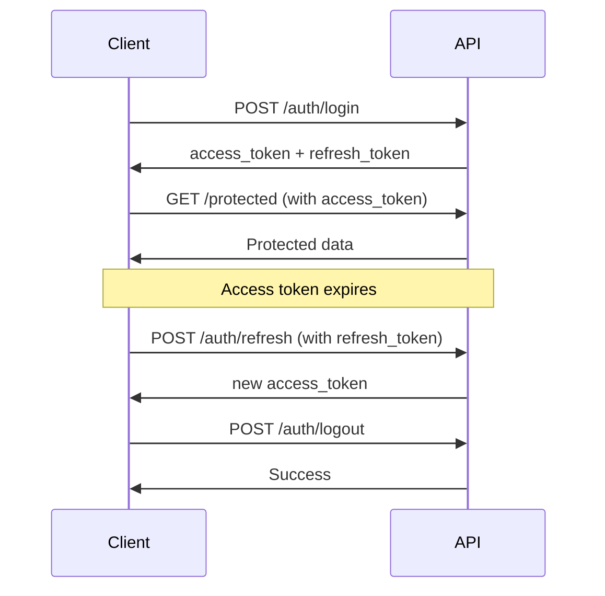

# API Documentation


This document provides comprehensive documentation for the Cybersecurity Toolkit Platform REST API.

## Table of Contents

1. [Overview](#overview)
2. [Authentication](#authentication)
3. [Error Handling](#error-handling)
4. [Rate Limiting](#rate-limiting)
5. [API Endpoints](#api-endpoints)
6. [WebSocket Events](#websocket-events)
7. [Data Models](#data-models)
8. [Examples](#examples)
9. [SDKs and Libraries](#sdks-and-libraries)

## Overview

### Base URL
```
Production: https://yourdomain.com/api
Development: http://localhost:5000/api
```

### API Version
Current version: `v1`

### Content Type
All requests and responses use `application/json` content type unless otherwise specified.

### HTTP Methods
- `GET`: Retrieve data
- `POST`: Create new resources
- `PUT`: Update existing resources
- `DELETE`: Remove resources

### Response Format
All API responses follow this structure:

```json
{
  "error": false,
  "message": "Success message",
  "data": {
    // Response data
  },
  "timestamp": "2024-01-01T12:00:00Z"
}
```

Error responses:
```json
{
  "error": true,
  "message": "Error description",
  "code": "ERROR_CODE",
  "details": "Additional error details",
  "timestamp": "2024-01-01T12:00:00Z"
}
```

## Authentication

### JWT Token Authentication

The API uses JWT (JSON Web Token) for authentication. Include the token in the Authorization header:

```http
Authorization: Bearer <your-jwt-token>
```

### Token Lifecycle

1. **Login**: Obtain access and refresh tokens
2. **Access Token**: Valid for 15 minutes
3. **Refresh Token**: Valid for 30 days
4. **Refresh**: Use refresh token to get new access token
5. **Logout**: Invalidate tokens

### Authentication Flow



## Error Handling

### HTTP Status Codes

- `200 OK`: Successful request
- `201 Created`: Resource created successfully
- `400 Bad Request`: Invalid request data
- `401 Unauthorized`: Authentication required
- `403 Forbidden`: Access denied
- `404 Not Found`: Resource not found
- `409 Conflict`: Resource conflict
- `429 Too Many Requests`: Rate limit exceeded
- `500 Internal Server Error`: Server error

### Error Codes

| Code | Description |
|------|-------------|
| `INVALID_CREDENTIALS` | Invalid username or password |
| `TOKEN_EXPIRED` | JWT token has expired |
| `INVALID_TARGET` | Invalid scan target format |
| `SCAN_NOT_FOUND` | Requested scan does not exist |
| `RATE_LIMIT_EXCEEDED` | Too many requests |
| `TOOL_UNAVAILABLE` | Security tool not available |
| `INSUFFICIENT_PERMISSIONS` | User lacks required permissions |

## Rate Limiting

### Limits

| Endpoint | Limit | Window |
|----------|-------|--------|
| `/auth/login` | 5 requests | 1 minute |
| `/auth/register` | 3 requests | 5 minutes |
| `/scans/start` | 10 requests | 10 minutes |
| General API | 100 requests | 1 minute |

### Headers

Rate limit information is included in response headers:

```http
X-RateLimit-Limit: 100
X-RateLimit-Remaining: 95
X-RateLimit-Reset: 1640995200
```

## API Endpoints

### Authentication Endpoints

#### POST /auth/register
Register a new user account.

**Request:**
```json
{
  "username": "johndoe",
  "email": "john@example.com",
  "password": "SecurePass123"
}
```

**Response:**
```json
{
  "error": false,
  "message": "User registered successfully",
  "user": {
    "id": 1,
    "username": "johndoe",
    "email": "john@example.com",
    "created_at": "2024-01-01T12:00:00Z"
  }
}
```

#### POST /auth/login
Authenticate user and obtain tokens.

**Request:**
```json
{
  "username": "johndoe",
  "password": "SecurePass123"
}
```

**Response:**
```json
{
  "error": false,
  "message": "Login successful",
  "access_token": "eyJ0eXAiOiJKV1QiLCJhbGciOiJIUzI1NiJ9...",
  "refresh_token": "eyJ0eXAiOiJKV1QiLCJhbGciOiJIUzI1NiJ9...",
  "user": {
    "id": 1,
    "username": "johndoe",
    "email": "john@example.com"
  }
}
```

#### POST /auth/refresh
Refresh access token using refresh token.

**Headers:**
```http
Authorization: Bearer <refresh-token>
```

**Response:**
```json
{
  "error": false,
  "message": "Token refreshed successfully",
  "access_token": "eyJ0eXAiOiJKV1QiLCJhbGciOiJIUzI1NiJ9..."
}
```

#### POST /auth/logout
Logout user and invalidate tokens.

**Headers:**
```http
Authorization: Bearer <access-token>
```

**Response:**
```json
{
  "error": false,
  "message": "Successfully logged out"
}
```

#### GET /auth/profile
Get current user profile.

**Headers:**
```http
Authorization: Bearer <access-token>
```

**Response:**
```json
{
  "error": false,
  "user": {
    "id": 1,
    "username": "johndoe",
    "email": "john@example.com",
    "created_at": "2024-01-01T12:00:00Z",
    "last_login": "2024-01-01T12:00:00Z"
  }
}
```

#### GET /auth/health
Health check endpoint.

**Response:**
```json
{
  "status": "healthy"
}
```

### Dashboard Endpoints

#### GET /dashboard/stats
Get user dashboard statistics.

**Headers:**
```http
Authorization: Bearer <access-token>
```

**Response:**
```json
{
  "user": {
    "username": "johndoe",
    "email": "john@example.com",
    "member_since": "2024-01-01T12:00:00Z",
    "last_login": "2024-01-01T12:00:00Z"
  },
  "stats": {
    "total_scans": 25,
    "completed_scans": 20,
    "failed_scans": 3,
    "running_scans": 2,
    "success_rate": 80.0,
    "recent_scans": 5
  }
}
```

#### GET /dashboard/recent-scans
Get recent scans for dashboard.

**Headers:**
```http
Authorization: Bearer <access-token>
```

**Response:**
```json
{
  "recent_scans": [
    {
      "id": 123,
      "target_ip": "example.com",
      "tools_used": ["nmap", "gobuster"],
      "status": "completed",
      "started_at": "2024-01-01T12:00:00Z",
      "completed_at": "2024-01-01T12:05:00Z",
      "duration": 300,
      "error_message": null
    }
  ]
}
```

#### GET /dashboard/system-status
Get system status and tool availability.

**Headers:**
```http
Authorization: Bearer <access-token>
```

**Response:**
```json
{
  "tools": {
    "nmap": {
      "available": true,
      "version": "Nmap version 7.80",
      "status": "online"
    },
    "gobuster": {
      "available": true,
      "version": "v3.1.0",
      "status": "online"
    },
    "dirb": {
      "available": true,
      "version": "Available",
      "status": "online"
    }
  },
  "system_health": 100.0,
  "available_tools": 3,
  "total_tools": 3,
  "last_checked": "2024-01-01T12:00:00Z"
}
```

### Scanning Endpoints

#### POST /scans/start
Start a new security scan.

**Headers:**
```http
Authorization: Bearer <access-token>
```

**Request:**
```json
{
  "target": "example.com",
  "tools": [
    {
      "tool_name": "nmap",
      "options": {
        "scan_type": "basic",
        "ports": "1-1000"
      }
    },
    {
      "tool_name": "gobuster",
      "options": {
        "mode": "dir",
        "wordlist": "/usr/share/wordlists/dirb/common.txt"
      }
    }
  ]
}
```

**Response:**
```json
{
  "error": false,
  "message": "Scan started successfully",
  "scan_id": 123
}
```

#### GET /scans/{scan_id}/status
Get scan status and progress.

**Headers:**
```http
Authorization: Bearer <access-token>
```

**Response:**
```json
{
  "error": false,
  "data": {
    "scan_id": 123,
    "status": "running",
    "target": "example.com",
    "start_time": "2024-01-01T12:00:00Z",
    "overall_progress": 75,
    "tools": {
      "nmap": {
        "status": "running",
        "progress": 80,
        "current_operation": "Port scanning"
      },
      "gobuster": {
        "status": "running",
        "progress": 70,
        "current_operation": "Directory enumeration"
      }
    }
  }
}
```

#### POST /scans/{scan_id}/stop
Stop a running scan.

**Headers:**
```http
Authorization: Bearer <access-token>
```

**Response:**
```json
{
  "error": false,
  "message": "Scan stopped successfully"
}
```

#### GET /scans/{scan_id}/results
Get scan results.

**Headers:**
```http
Authorization: Bearer <access-token>
```

**Response:**
```json
{
  "error": false,
  "data": {
    "scan_id": 123,
    "status": "completed",
    "target": "example.com",
    "start_time": "2024-01-01T12:00:00Z",
    "completed_at": "2024-01-01T12:05:00Z",
    "tools": {
      "nmap": {
        "parsed_results": {
          "open_ports": [80, 443, 22],
          "services": [
            {
              "port": 80,
              "protocol": "tcp",
              "service": "http",
              "version": "Apache 2.4.41"
            }
          ]
        },
        "output_file": "/path/to/nmap_output.txt"
      },
      "gobuster": {
        "parsed_results": {
          "findings": [
            {
              "path": "/admin",
              "status": 200,
              "size": 1024
            }
          ]
        },
        "output_file": "/path/to/gobuster_output.txt"
      }
    }
  }
}
```

#### GET /scans/{scan_id}/export
Export scan results.

**Headers:**
```http
Authorization: Bearer <access-token>
```

**Query Parameters:**
- `format`: Export format (txt, json, csv, html, xml)
- `tool`: Specific tool to export (optional)
- `filter`: Filter string (optional)

**Response:**
File download with appropriate content type.

#### POST /scans/{scan_id}/share
Create shareable link for scan results.

**Headers:**
```http
Authorization: Bearer <access-token>
```

**Request:**
```json
{
  "expiration": 3600,
  "tool": "nmap"
}
```

**Response:**
```json
{
  "error": false,
  "data": {
    "share_id": "abc123",
    "url": "/api/scans/share/abc123",
    "expires_at": "2024-01-02T12:00:00Z"
  }
}
```

#### GET /scans/share/{share_id}
Access shared scan results (no authentication required).

**Response:**
```json
{
  "error": false,
  "data": {
    "scan_id": 123,
    "target": "example.com",
    "status": "completed",
    "tools": {
      // Filtered tool results
    }
  }
}
```

#### GET /scans/tools/availability
Check tool availability.

**Headers:**
```http
Authorization: Bearer <access-token>
```

**Response:**
```json
{
  "error": false,
  "data": {
    "nmap": {
      "available": true,
      "message": "nmap is available"
    },
    "gobuster": {
      "available": false,
      "message": "gobuster is not installed or not in PATH"
    },
    "dirb": {
      "available": true,
      "message": "dirb is available"
    }
  }
}
```

### History Endpoints

#### GET /history/scans
Get scan history with pagination and filtering.

**Headers:**
```http
Authorization: Bearer <access-token>
```

**Query Parameters:**
- `page`: Page number (default: 1)
- `limit`: Items per page (default: 20, max: 100)
- `startDate`: Filter by start date (ISO format)
- `endDate`: Filter by end date (ISO format)
- `target`: Filter by target
- `status`: Filter by status
- `tools`: Filter by tools (multiple values allowed)

**Response:**
```json
{
  "data": [
    {
      "id": 123,
      "target_ip": "example.com",
      "tools_used": ["nmap", "gobuster"],
      "status": "completed",
      "started_at": "2024-01-01T12:00:00Z",
      "completed_at": "2024-01-01T12:05:00Z",
      "error_message": null
    }
  ],
  "total": 50,
  "page": 1,
  "limit": 20,
  "totalPages": 3
}
```

#### GET /history/scans/{scan_id}
Get detailed scan information.

**Headers:**
```http
Authorization: Bearer <access-token>
```

**Response:**
```json
{
  "id": 123,
  "target_ip": "example.com",
  "tools_used": ["nmap", "gobuster"],
  "status": "completed",
  "started_at": "2024-01-01T12:00:00Z",
  "completed_at": "2024-01-01T12:05:00Z",
  "results": "Raw scan results...",
  "scan_config": {
    "tools": [
      {
        "tool_name": "nmap",
        "options": {
          "scan_type": "basic"
        }
      }
    ]
  }
}
```

#### GET /history/search
Search scan history.

**Headers:**
```http
Authorization: Bearer <access-token>
```

**Query Parameters:**
- `q`: Search query
- `page`: Page number (default: 1)
- `limit`: Items per page (default: 20, max: 100)

**Response:**
```json
{
  "data": [
    {
      "id": 123,
      "target_ip": "example.com",
      "tools_used": ["nmap"],
      "status": "completed",
      "started_at": "2024-01-01T12:00:00Z",
      "relevance_score": 85
    }
  ],
  "total": 10,
  "page": 1,
  "limit": 20,
  "totalPages": 1
}
```

#### POST /history/scans/{scan_id}/rerun
Re-run a previous scan.

**Headers:**
```http
Authorization: Bearer <access-token>
```

**Response:**
```json
{
  "scanId": 124,
  "message": "Scan queued for execution"
}
```

#### GET /history/scans/{scan_id}/export
Export historical scan results.

**Headers:**
```http
Authorization: Bearer <access-token>
```

**Query Parameters:**
- `format`: Export format (json, txt, csv)

**Response:**
File download with scan results.

### Settings Endpoints

#### GET /settings/profile
Get user profile information.

**Headers:**
```http
Authorization: Bearer <access-token>
```

**Response:**
```json
{
  "id": 1,
  "username": "johndoe",
  "email": "john@example.com",
  "created_at": "2024-01-01T12:00:00Z",
  "last_login": "2024-01-01T12:00:00Z",
  "is_active": true
}
```

#### PUT /settings/profile
Update user profile.

**Headers:**
```http
Authorization: Bearer <access-token>
```

**Request:**
```json
{
  "username": "newusername",
  "email": "newemail@example.com"
}
```

**Response:**
```json
{
  "error": false,
  "message": "Profile updated successfully",
  "user": {
    "id": 1,
    "username": "newusername",
    "email": "newemail@example.com"
  }
}
```

#### POST /settings/profile/picture
Upload profile picture.

**Headers:**
```http
Authorization: Bearer <access-token>
Content-Type: multipart/form-data
```

**Request:**
Form data with `file` field containing image file.

**Response:**
```json
{
  "message": "Profile picture uploaded successfully",
  "url": "/uploads/profile_pictures/user_1_avatar.jpg"
}
```

#### POST /settings/password
Change user password.

**Headers:**
```http
Authorization: Bearer <access-token>
```

**Request:**
```json
{
  "current_password": "OldPass123",
  "new_password": "NewPass123"
}
```

**Response:**
```json
{
  "message": "Password changed successfully"
}
```

#### GET /settings/preferences
Get user preferences.

**Headers:**
```http
Authorization: Bearer <access-token>
```

**Response:**
```json
{
  "id": 1,
  "user_id": 1,
  "theme": "dark",
  "default_tools": ["nmap", "gobuster"],
  "notifications_enabled": true,
  "default_wordlist": "/usr/share/wordlists/dirb/common.txt",
  "auto_export": false
}
```

#### PUT /settings/preferences
Update user preferences.

**Headers:**
```http
Authorization: Bearer <access-token>
```

**Request:**
```json
{
  "theme": "light",
  "default_tools": ["nmap"],
  "notifications_enabled": false,
  "auto_export": true
}
```

**Response:**
```json
{
  "error": false,
  "message": "Preferences updated successfully",
  "settings": {
    "theme": "light",
    "default_tools": ["nmap"],
    "notifications_enabled": false,
    "auto_export": true
  }
}
```

#### POST /settings/account/delete
Delete user account.

**Headers:**
```http
Authorization: Bearer <access-token>
```

**Request:**
```json
{
  "password": "UserPass123"
}
```

**Response:**
```json
{
  "message": "Account deleted successfully"
}
```

#### GET /settings/tools/available
Get available security tools.

**Headers:**
```http
Authorization: Bearer <access-token>
```

**Response:**
```json
{
  "nmap": {
    "name": "Nmap",
    "description": "Network discovery and security auditing",
    "available": true,
    "version": "7.80"
  },
  "gobuster": {
    "name": "Gobuster",
    "description": "Directory/file & DNS busting tool",
    "available": true,
    "version": "3.1.0"
  },
  "dirb": {
    "name": "Dirb",
    "description": "Web content scanner",
    "available": true,
    "version": "2.22"
  }
}
```

#### GET /settings/wordlists
Get available wordlists.

**Headers:**
```http
Authorization: Bearer <access-token>
```

**Response:**
```json
[
  "/usr/share/wordlists/dirb/common.txt",
  "/usr/share/wordlists/dirb/big.txt",
  "/usr/share/wordlists/dirbuster/directory-list-2.3-medium.txt",
  "wordlists/user_1/custom.txt"
]
```

#### POST /settings/wordlists/upload
Upload custom wordlist.

**Headers:**
```http
Authorization: Bearer <access-token>
Content-Type: multipart/form-data
```

**Request:**
Form data with `file` field containing wordlist file.

**Response:**
```json
{
  "message": "Wordlist uploaded successfully",
  "path": "wordlists/user_1/custom.txt"
}
```

#### GET /settings/account/export
Export user data.

**Headers:**
```http
Authorization: Bearer <access-token>
```

**Response:**
```json
{
  "user": {
    "id": 1,
    "username": "johndoe",
    "email": "john@example.com"
  },
  "settings": {
    "theme": "dark",
    "default_tools": ["nmap"]
  },
  "scan_history": [
    {
      "id": 123,
      "target_ip": "example.com",
      "status": "completed"
    }
  ]
}
```

#### GET /settings/account/activity
Get user activity logs.

**Headers:**
```http
Authorization: Bearer <access-token>
```

**Query Parameters:**
- `page`: Page number (default: 1)
- `per_page`: Items per page (default: 10, max: 50)

**Response:**
```json
{
  "logs": [
    {
      "id": 1,
      "user_id": 1,
      "action": "login",
      "description": "User logged in from 192.168.1.1",
      "created_at": "2024-01-01T12:00:00Z"
    }
  ],
  "pagination": {
    "total": 100,
    "pages": 10,
    "page": 1,
    "per_page": 10,
    "has_next": true,
    "has_prev": false
  }
}
```

## WebSocket Events

### Connection
Connect to WebSocket endpoint:
```
ws://localhost:5000/socket.io/
wss://yourdomain.com/socket.io/
```

### Authentication
Send authentication token after connection:
```javascript
socket.emit('authenticate', { token: 'your-jwt-token' });
```

### Events

#### scan_progress
Real-time scan progress updates.

**Payload:**
```json
{
  "scan_id": 123,
  "tool": "nmap",
  "progress": 75,
  "status": "running",
  "output": "Starting Nmap scan...",
  "current_operation": "Port scanning"
}
```

#### scan_completed
Scan completion notification.

**Payload:**
```json
{
  "scan_id": 123,
  "status": "completed",
  "duration": 300,
  "results_available": true
}
```

#### scan_failed
Scan failure notification.

**Payload:**
```json
{
  "scan_id": 123,
  "status": "failed",
  "error": "Target unreachable",
  "error_code": "TARGET_UNREACHABLE"
}
```

#### system_status
System status updates.

**Payload:**
```json
{
  "tools": {
    "nmap": { "available": true, "status": "online" },
    "gobuster": { "available": false, "status": "offline" }
  },
  "system_health": 66.7
}
```

## Data Models

### User
```json
{
  "id": 1,
  "username": "johndoe",
  "email": "john@example.com",
  "created_at": "2024-01-01T12:00:00Z",
  "last_login": "2024-01-01T12:00:00Z",
  "is_active": true
}
```

### ScanHistory
```json
{
  "id": 123,
  "user_id": 1,
  "target_ip": "example.com",
  "tools_used": ["nmap", "gobuster"],
  "status": "completed",
  "started_at": "2024-01-01T12:00:00Z",
  "completed_at": "2024-01-01T12:05:00Z",
  "results_path": "/path/to/results.json",
  "scan_config": {
    "tools": [
      {
        "tool_name": "nmap",
        "options": { "scan_type": "basic" }
      }
    ]
  },
  "error_message": null
}
```

### UserSettings
```json
{
  "id": 1,
  "user_id": 1,
  "theme": "dark",
  "default_tools": ["nmap", "gobuster"],
  "notifications_enabled": true,
  "default_wordlist": "/usr/share/wordlists/dirb/common.txt",
  "auto_export": false
}
```

### ActivityLog
```json
{
  "id": 1,
  "user_id": 1,
  "action": "login",
  "description": "User logged in from 192.168.1.1",
  "ip_address": "192.168.1.1",
  "user_agent": "Mozilla/5.0...",
  "created_at": "2024-01-01T12:00:00Z"
}
```

## Examples

### Python Example

```python
import requests
import json

# Base URL
BASE_URL = "https://yourdomain.com/api"

# Login
login_data = {
    "username": "johndoe",
    "password": "SecurePass123"
}

response = requests.post(f"{BASE_URL}/auth/login", json=login_data)
tokens = response.json()

# Set authorization header
headers = {
    "Authorization": f"Bearer {tokens['access_token']}",
    "Content-Type": "application/json"
}

# Start a scan
scan_data = {
    "target": "example.com",
    "tools": [
        {
            "tool_name": "nmap",
            "options": {
                "scan_type": "basic",
                "ports": "1-1000"
            }
        }
    ]
}

response = requests.post(f"{BASE_URL}/scans/start", json=scan_data, headers=headers)
scan_result = response.json()
scan_id = scan_result['scan_id']

# Check scan status
response = requests.get(f"{BASE_URL}/scans/{scan_id}/status", headers=headers)
status = response.json()
print(f"Scan status: {status['data']['status']}")

# Get scan results (when completed)
response = requests.get(f"{BASE_URL}/scans/{scan_id}/results", headers=headers)
results = response.json()
print(json.dumps(results, indent=2))
```

### JavaScript Example

```javascript
// Base URL
const BASE_URL = 'https://yourdomain.com/api';

// Login function
async function login(username, password) {
  const response = await fetch(`${BASE_URL}/auth/login`, {
    method: 'POST',
    headers: {
      'Content-Type': 'application/json',
    },
    body: JSON.stringify({ username, password }),
  });
  
  const data = await response.json();
  if (data.error) {
    throw new Error(data.message);
  }
  
  return data.access_token;
}

// Start scan function
async function startScan(token, target, tools) {
  const response = await fetch(`${BASE_URL}/scans/start`, {
    method: 'POST',
    headers: {
      'Authorization': `Bearer ${token}`,
      'Content-Type': 'application/json',
    },
    body: JSON.stringify({ target, tools }),
  });
  
  const data = await response.json();
  if (data.error) {
    throw new Error(data.message);
  }
  
  return data.scan_id;
}

// Usage
(async () => {
  try {
    const token = await login('johndoe', 'SecurePass123');
    
    const scanId = await startScan(token, 'example.com', [
      {
        tool_name: 'nmap',
        options: {
          scan_type: 'basic',
          ports: '1-1000'
        }
      }
    ]);
    
    console.log(`Scan started with ID: ${scanId}`);
  } catch (error) {
    console.error('Error:', error.message);
  }
})();
```

### cURL Examples

```bash
# Login
curl -X POST https://yourdomain.com/api/auth/login \
  -H "Content-Type: application/json" \
  -d '{"username":"johndoe","password":"SecurePass123"}'

# Start scan (replace TOKEN with actual token)
curl -X POST https://yourdomain.com/api/scans/start \
  -H "Authorization: Bearer TOKEN" \
  -H "Content-Type: application/json" \
  -d '{
    "target": "example.com",
    "tools": [
      {
        "tool_name": "nmap",
        "options": {
          "scan_type": "basic",
          "ports": "1-1000"
        }
      }
    ]
  }'

# Check scan status
curl -X GET https://yourdomain.com/api/scans/123/status \
  -H "Authorization: Bearer TOKEN"

# Get scan results
curl -X GET https://yourdomain.com/api/scans/123/results \
  -H "Authorization: Bearer TOKEN"

# Export scan results
curl -X GET "https://yourdomain.com/api/scans/123/export?format=json" \
  -H "Authorization: Bearer TOKEN" \
  -o scan_results.json
```

## SDKs and Libraries

### Official SDKs
- **Python SDK**: `pip install cybersecurity-toolkit-sdk`
- **JavaScript SDK**: `npm install cybersecurity-toolkit-sdk`
- **Go SDK**: `go get github.com/cybersecurity-toolkit/go-sdk`

### Community Libraries
- **PHP Client**: Available on Packagist
- **Ruby Gem**: Available on RubyGems
- **Java Client**: Available on Maven Central

### SDK Example (Python)

```python
from cybersecurity_toolkit import CyberSecurityToolkit

# Initialize client
client = CyberSecurityToolkit(
    base_url="https://yourdomain.com/api",
    username="johndoe",
    password="SecurePass123"
)

# Start a scan
scan = client.scans.start(
    target="example.com",
    tools=[
        client.tools.nmap(scan_type="basic", ports="1-1000"),
        client.tools.gobuster(mode="dir")
    ]
)

# Wait for completion
scan.wait_for_completion()

# Get results
results = scan.get_results()
print(results.nmap.open_ports)
```

---

For more information or support, please contact the development team or refer to the platform documentation.